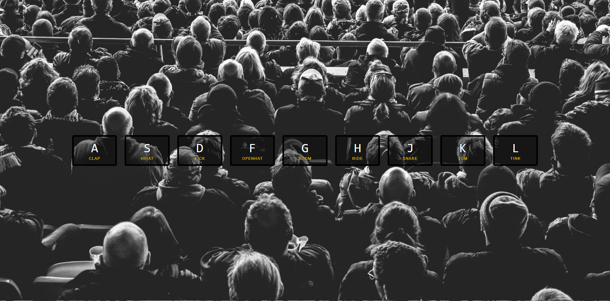

# 01 - JavaScript Drum Kit



鍵盤打鼓，當上按下 'A', 'S', 'D', 'F', 'G', 'H', 'J', 'K', 'L' 時，對應的按鍵**產生高亮效果**與**播放音效**，在按下其他鍵後會關閉該特效並於新按鍵中啟用。

## `Array.from`

`querySelectorAll` 返回的是 `nodeList`， `nodeList` 跟 `Array` 是不同的！

```js
const keys = Array.from(document.querySelectorAll('.key'));
```

## ES6 樣板字面值

```js
const audio = document.querySelector(`audio[data-key="${e.keyCode}"]`);
const key = document.querySelector(`div[data-key="${e.keyCode}"]`);
```

## ES6 箭頭函式 ( Arrow Function )

```js
keys.forEach(function (key) {
    return key.addEventListener('transitionend', removeTransition, false);
});

// 箭頭函式
keys.forEach(key => key.addEventListener('transitionend', removeTransition, false));

// 補充: 如果沒參數要傳，可用空括號代替
let exampleFunction = () => {
    // ...
};
```

## 解決難點

### 如何將鍵盤按鍵與頁面按鈕對應起來？

連接的幫手是 `keydown` 事件中的 `keyCode` 屬性，`keyCode` 屬性的值和 ASCII 編碼值相同（對應小寫字母）。這個網站可以用按鍵盤來查看對應的鍵碼 [keycode.info](http://keycode.info/)。

### 選取相對的按鈕

運用 `data-key` 儲存對應的代碼，取得 `keyCode` 以此為線索，`querySelector` 選取器的運用，操作對應的按鈕及音頻。

```js
const audio = document.querySelector(`audio[data-key="${e.keyCode}"]`);
const key = document.querySelector(`div[data-key="${e.keyCode}"]`);
```

### 如何播放音效，並保證按鍵被按住不放時，可以馬上響起連續鼓點聲？

播放音效需要取的 HTMLmediaElement(audio) 標籤在透過 javascript 操作。

```html
<!-- 指定音源 -->
<audio src="sound/a.mp3"></audio>
```

```js
// 進行播放
audio.play();
```

每次播放音頻之前，設置播放時間戳為 0。

```js
// 指定播放秒數
audio.currentTime = 0;
```

### 如何使頁面按鈕恢復原狀？

監聽 `transitionened` 事件，它在 `CSS transition` 結束後被觸發！可以利用這個事件，每次打鼓的效果（尺寸變大，顏色變化）完成之後，去除相應樣式。

監聽 `transitionened` 事件中，發生轉換的樣式屬性有許多個（box-shadow、transform、border-color...等等），添加一個判斷語句，使每發生一次按鍵事件時，只去除一次樣式。

```js
funciton remove(event) {
    if (event.propertyName !== 'transform') return;
    this.classList.remove('playing');
    // event.target.classList.remove('playing');
}
```